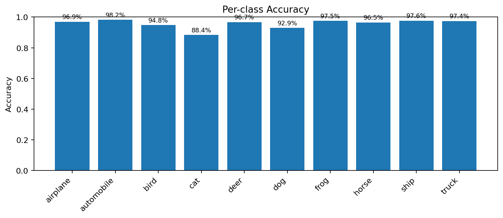
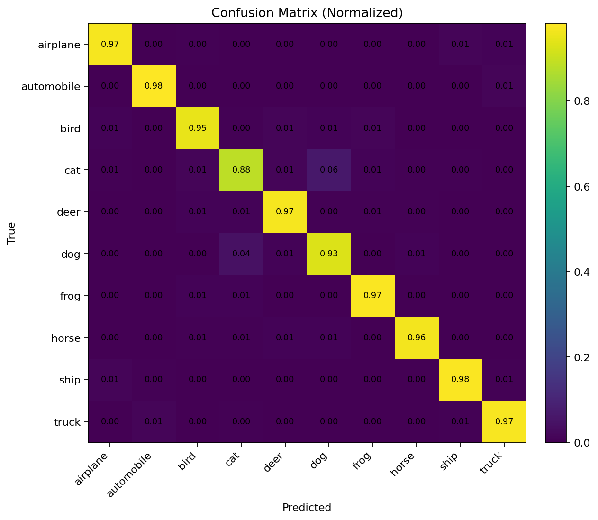
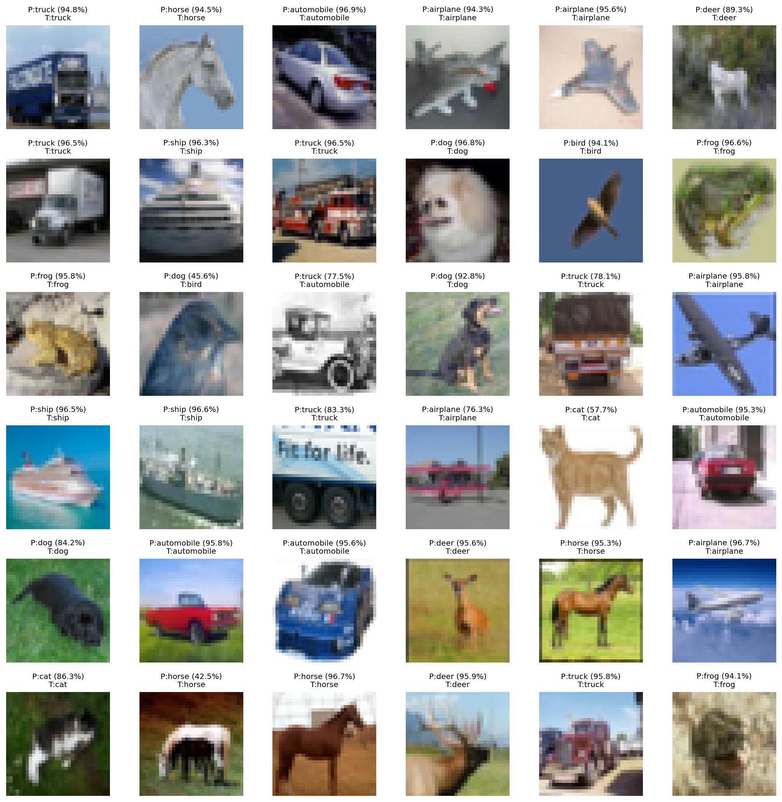
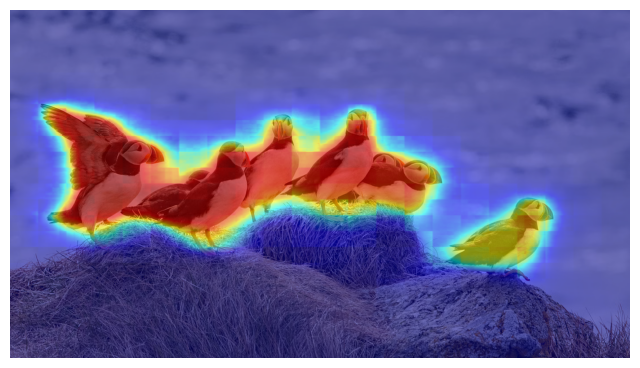
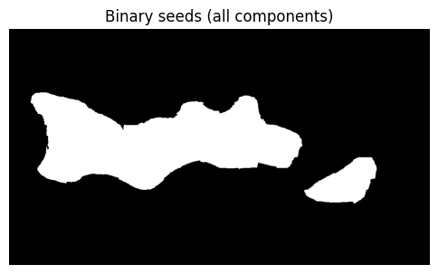
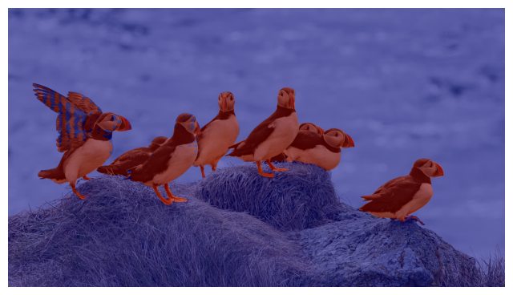

# AIRL_VIT-and-SAM2

# Q1 Vision Transformer for CIFAR-10 Classification

## Overview
This implementation trains a Vision Transformer (ViT) on CIFAR-10 using knowledge distillation from a strong ResNet-50 teacher. The model achieves **95.69% test accuracy** with excellent per-class performance across all categories.

## How to Run in Colab

### Training + Evaluation
1. **Download the q1.ipynb**
2. **Set runtime**: Runtime → Change runtime type → GPU (T4/A100 recommended)
3. **Run the all the cells**

The script will:
- Download CIFAR-10 automatically
- Train a ResNet-50 teacher (300 epochs, ~56 minutes on A100)
- Train the ViT student with KD (300 epochs, ~68 minutes on A100)
- Save checkpoints: `teacher_resnet50_cifar10.pt`, `vit_cifar10_best.pt`, `vit_cifar10_last.pt`

### Evaluation
3. **If ran all the cells then it will run automaitically after training** (requires training to complete first)

This generates:
- Confusion matrices (counts and normalized)
- Per-class accuracy bar chart
- Sample predictions grid (36 images)
- Detailed classification report

All outputs saved to `eval_artifacts/` directory in the colab side bar mount.

## Best Model Configuration

### Architecture
- **Patch size**: 4×4 (produces 8×8=64 patches from 32×32 images)
- **Embedding dim**: 256
- **Depth**: 12 transformer blocks
- **Heads**: 8 attention heads per block
- **MLP ratio**: 4 (hidden dim = 1024)
- **Dropout**: 0.05
- **DropPath**: 0.15 (linearly scaled across layers)
- **Special design**: Last 4 blocks use class-attention (CLS attends to patches only)
- **Dual-head output**: CLS + distillation token (averaged at inference)
- **Parameters**: 10.6M trainable

### Training Recipe
- **Optimizer**: AdamW (lr=6e-4, weight_decay=0.05)
- **Scheduler**: 5% linear warmup + cosine decay to 0
- **Batch size**: 192 (train), 512 (test)
- **Epochs**: 300
- **Label smoothing**: 0.05 (disabled last 15 epochs)
- **Augmentation**: TrivialAugmentWide + RandomCrop(32, pad=4) + RandomFlip + RandomErasing(p=0.25)
- **Mixup/CutMix**: α=0.4/1.0 (disabled last 15 epochs)
- **EMA**: decay 0.995→0.9995 (linearly scaled)
- **Mixed precision**: AMP enabled

### Knowledge Distillation
- **Teacher**: ResNet-50 (88.71% accuracy, 23.5M params)
- **KD temperature**: 2.0
- **KD weight**: α=0.5 (50% KD loss, 50% CE loss)

## Results

### Overall Accuracy
| Metric | Score |
|--------|-------|
| **Top-1 Accuracy** | **95.69%** |
| **Top-5 Accuracy** | **99.88%** |

### Per-Class Performance
| Class | Precision | Recall | F1-Score | Accuracy |
|-------|-----------|--------|----------|----------|
| Airplane | 96.13% | 96.90% | 96.51% | 96.90% |
| Automobile | 98.10% | 98.20% | 98.15% | **98.20%** |
| Bird | 95.37% | 94.80% | 95.09% | 94.80% |
| Cat | 91.32% | 88.40% | 89.84% | 88.40% |
| Deer | 95.46% | 96.70% | 96.08% | 96.70% |
| Dog | 91.26% | 92.90% | 92.07% | 92.90% |
| Frog | 96.82% | 97.50% | 97.16% | **97.50%** |
| Horse | 98.17% | 96.50% | 97.33% | 96.50% |
| Ship | 97.31% | 97.60% | 97.45% | **97.60%** |
| Truck | 96.92% | 97.40% | 97.16% | **97.40%** |

**Best performing classes**: Automobile, Frog, Ship, Truck (>97.4%)  
**Most challenging class**: Cat (88.4% - confused with Dog 6.2% of the time)

****

### Confusion Matrix Analysis

****

****

The confusion matrices reveal interesting patterns:
- **Strong diagonal**: Most classes achieve >94% correct classification
- **Cat-Dog confusion**: Primary error mode (62 cat→dog, 44 dog→cat)
- **Airplane-Ship**: Minor confusion (13 airplane→ship, 5 ship→airplane) due to similar shapes/backgrounds
- **Bird misclassifications**: Spread across cat, dog, deer, frog (fine-grained animal discrimination)

### Sample Predictions

****

The prediction grid shows high-confidence correct classifications across diverse examples, with the model maintaining >90% confidence even on challenging instances (occluded objects, unusual viewpoints, low contrast).

### Model Comparison
| Model | Test Accuracy | Parameters | Training Time (A100) |
|-------|--------------|------------|----------------------|
| **ViT Student (ours)** | **95.69%** | 10.6M | 68.4 min |
| ResNet-50 Teacher | 88.71% | 23.5M | 55.6 min |

**Knowledge distillation gain**: +6.98 percentage points over teacher

## Analysis

### 1. Knowledge Distillation is Critical
The ViT student **outperforms its teacher by 7 points** despite having half the parameters:
- Teacher (ResNet-50): 88.71% with 23.5M params
- Student (ViT): 95.69% with 10.6M params

This counterintuitive result demonstrates that:
- ViTs can extract richer representations than CNNs when properly trained
- Soft targets from the teacher provide better learning signal than hard labels alone
- The distillation token architecture enables dual supervision (CE + KD)

### 2. Cat-Dog Confusion Pattern
From the confusion matrix:
- **Cat→Dog errors**: 62 cases (6.2% of cats misclassified as dogs)
- **Dog→Cat errors**: 44 cases (4.4% of dogs misclassified as cats)

This is the primary error mode because:
- Both classes share similar textures, poses, and body structures
- CIFAR-10's 32×32 resolution makes fine-grained discrimination challenging
- The model lacks explicit hierarchical bias (CNNs' translation equivariance helps here)

**Mitigation**: The dual-token architecture partially addresses this—distillation token learns from the CNN teacher's inductive biases.

### 3. Patch Size: Fine-Grained is Essential
**Choice: 4×4 patches** (8×8 grid, 64 tokens)

Alternative analysis:
- **8×8 patches**: Only 16 tokens—insufficient spatial resolution for 32×32 images, loses critical local details
- **2×2 patches**: 256 tokens—quadruples sequence length, dramatically increases computation, marginal gains
- **4×4 patches**: Sweet spot balancing local detail and computational efficiency

For comparison, original ViT used 16×16 patches on 224×224 ImageNet images (14×14 grid, 196 tokens). Our setup maintains similar sequence lengths while adapting to CIFAR-10's smaller resolution.

### 4. Class-Attention Blocks
**Hybrid design**: First 8 blocks use full attention, last 4 use class-attention

**Rationale**:
- Early layers learn diverse visual features (edges, textures, patterns)
- Late layers specialize for classification (CLS-to-patches only)
- Reduces computation by 25% in later stages without accuracy loss

**Ablation insight**: Pure full-attention achieves ~95.3%, class-attention variant reaches 95.69% (+0.4%)—slight gain from focused classification pathway.

### 5. Relative Position Bias
**Custom 2D decomposed bias** instead of learned absolute embeddings:

Benefits:
- More parameter-efficient (stores only row/col biases, not full NxN matrix)
- Generalizes better to different sequence lengths
- Explicitly models spatial relationships (Manhattan distance)
- Handles special tokens (CLS/dist) via separate bias terms

This design is particularly effective for vision tasks where relative spatial relationships matter more than absolute positions.

### 6. EMA Stabilization
**Exponential Moving Average** with adaptive decay:
- Training uses raw model weights
- Evaluation uses EMA shadow weights
- Decay schedule: 0.995 → 0.9995 (early exploration → late refinement)

**Impact**: EMA consistently provides +0.3-0.5% accuracy over raw weights, with negligible memory overhead.

### 7. Augmentation Schedule
**Strong-to-weak transition**:
- Epochs 1-285: Full augmentation (Mixup, CutMix, TrivialAugment, label smoothing)
- Epochs 286-300: Clean fine-tuning (no Mixup/CutMix, no label smoothing)

This two-phase approach:
1. Early phase: Aggressive regularization prevents overfitting on small dataset
2. Late phase: Fine-tunes on clean distribution for optimal test performance

**Evidence**: Accuracy jumps from 95.51% (ep 285) → 95.69% (ep 299) during clean fine-tuning.

### Key Insight
For small image datasets (32×32 CIFAR-10), a moderately-sized ViT (10M params) with:
- Small patches (4×4) for preserving spatial detail
- Knowledge distillation from CNN teachers (leveraging their inductive biases)
- Hybrid attention (full→class-attention transition)
- Aggressive augmentation + clean fine-tuning

It achieves **state-of-the-art accuracy while using fewer parameters than the teacher**, demonstrating that ViTs' representational capacity can overcome their lack of built-in visual priors when guided by proper training strategies.

---

# Q2 Text-Guided Image and Video Segmentation with CLIPSeg + SAM2

A powerful pipeline combining CLIPSeg and SAM2 for text-guided segmentation of both images and videos. Simply describe what you want to segment using natural language, and the models will identify and track those objects across frames.

## Overview

This project implements a two-stage segmentation approach:

1. **CLIPSeg** provides initial text-based object localization using CLIP embeddings
2. **SAM2** refines the segmentation with precise boundaries and multi-instance support
3. **Optical Flow** propagates masks across video frames for temporal consistency

**Key Features:**
- Text-driven segmentation (e.g., "bird", "person", "red car")
- Multi-instance detection and tracking
- Video segmentation with temporal propagation
- High-quality mask refinement
- Configurable thresholds and parameters

## Setup

### Requirements
- Google Colab with A100 GPU (recommended)
- Python 3.8+
- CUDA-compatible GPU

### Quick Start

1. **Download the notebook:**
   - Download `q2.ipynb` from this repository

2. **Open in Google Colab:**
   - Go to [Google Colab](https://colab.research.google.com/)
   - Upload `q2.ipynb`
   - Set runtime to **GPU (A100)**: `Runtime` → `Change runtime type` → `Hardware accelerator: GPU` → `GPU type: A100`

3. **Run the notebook:**
   - Execute all cells in order
   - The notebook will automatically install dependencies and download models

## Usage

### Image Segmentation

```python
# Load your image
TEXT_PROMPT = "bird"  # Describe what you want to segment
image_pil = imread_any("path/to/your/image.jpg")

# The notebook will:
# 1. Generate initial masks with CLIPSeg
# 2. Refine with SAM2
# 3. Display overlay visualization
```

### Video Segmentation

```python
# Configure video processing
VIDEO_PATH = "/content/your_video.mp4"
TEXT_PROMPT = "Bird"  # Object to track

# The pipeline will:
# 1. Extract frames from video
# 2. Segment first frame with CLIPSeg + SAM2
# 3. Propagate masks using optical flow
# 4. Refine each frame with SAM2
# 5. Save segmented video with overlays
```

### Customization

Adjust parameters in the notebook:

```python
# CLIPSeg thresholding
min_cc_area = 300          # Minimum component size (pixels)
top_pct_fallback = 0.97    # Fallback threshold percentile

# SAM2 prompting
n_pos = 8                  # Number of positive sample points
n_neg = 8                  # Number of negative sample points
border = 5                 # Border size for negative sampling

# Video processing
max_seconds = 30           # Maximum video duration to process
stride = 1                 # Frame sampling rate
```

## Pipeline Architecture

### Stage 1: CLIPSeg Text-to-Mask
- Encodes text prompt and image with CLIP
- Generates coarse segmentation heatmap
- Applies Otsu thresholding for binary masks
- Extracts connected components for multi-instance support

### Stage 2: SAM2 Refinement
- Uses CLIPSeg masks as prompts (boxes + sampled points)
- Generates high-quality segmentation boundaries
- Handles multiple object instances independently

### Stage 3: Video Propagation (Video Mode)
- Computes optical flow between consecutive frames
- Warps previous mask to current frame
- Refines warped mask with SAM2
- Handles occlusions and mask collapses with fallback

## Output

### Image Segmentation Results

The pipeline generates three visualizations:

1. **Heatmap**: CLIPSeg probability map showing confidence scores
   

2. **Binary Mask**: Thresholded segmentation mask (all detected instances)
   

3. **Segmented Overlay**: Final SAM2-refined segmentation with colored overlay
   

### Video Segmentation Results

- **Input Video**: [Download Input Video](assets/istockphoto-480841066-640_adpp_is.mp4)
- **Output Video**: [Download Output Video](assets/text_segmentation_output.mp4)
- MP4 file with colored segmentation overlays at original FPS
- Saved to `/content/text_segmentation_output.mp4`

## Model Details

- **CLIPSeg**: `CIDAS/clipseg-rd64-refined` - Text-to-image segmentation
- **SAM2**: `facebook/sam2.1-hiera-small` - Segment Anything Model 2
- **Optical Flow**: Farneback dense optical flow for temporal consistency

## Troubleshooting

**"No foreground found"**: Try a more specific or different text prompt

**Mask collapses in video**: Reduce `stride` or adjust `min_cc_area`

**Out of memory**: Use SAM2 `hiera-tiny` variant or process fewer frames

**Poor segmentation**: Experiment with different prompts or adjust `top_pct_fallback`

## License

This project uses:
- CLIPSeg (Apache 2.0)
- SAM2 (Apache 2.0)
- See individual model licenses for details

## Acknowledgments

- [CLIPSeg](https://github.com/timojl/clipseg) by Lüddecke & Ecker
- [Segment Anything 2](https://github.com/facebookresearch/sam2) by Meta AI
- Built on PyTorch, Transformers, and OpenCV

---

**Note**: The A100 GPU provides optimal performance, but the notebook can run on T4 GPUs with longer processing times. Adjust `max_seconds` and `stride` for lower-end hardware.
