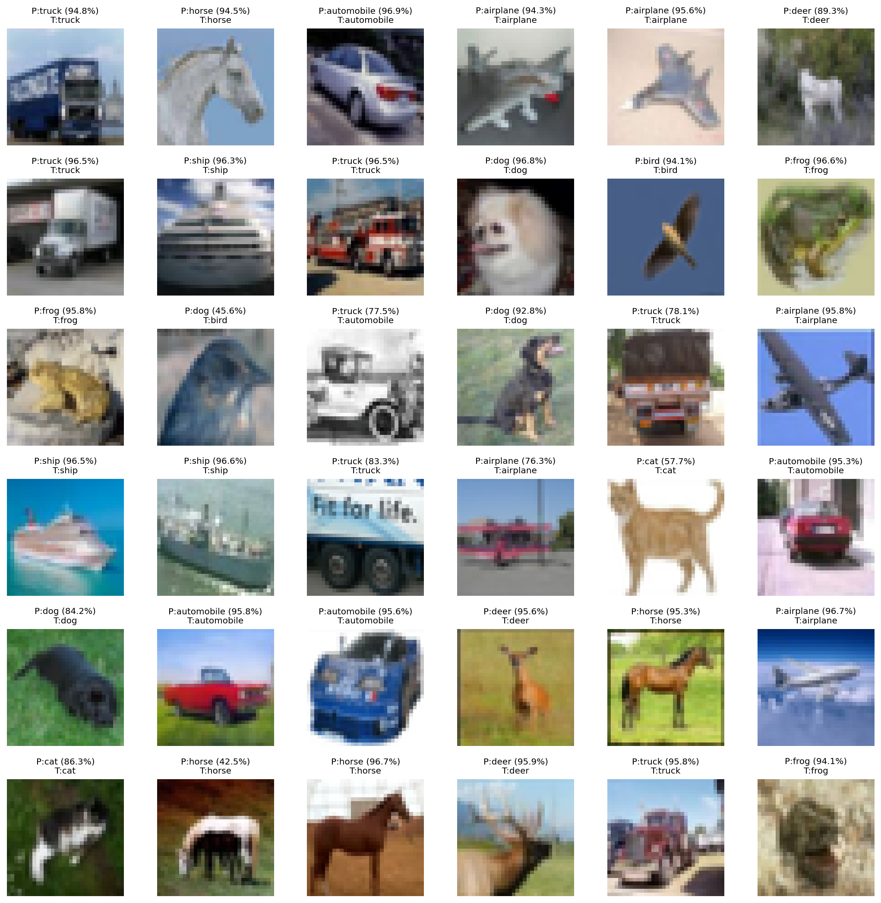

# Q1 Vision Transformer for CIFAR-10 Classification

## Overview
This implementation trains a Vision Transformer (ViT) on CIFAR-10 using knowledge distillation from a strong ResNet-50 teacher. The model achieves **95.69% test accuracy** with excellent per-class performance across all categories.

## How to Run in Colab

### Training + Evaluation
1. **Download the q1.ipynb**
2. **Set runtime**: Runtime → Change runtime type → GPU (T4/A100 recommended)
3. **Run the all the cells**

The script will:
- Download CIFAR-10 automatically
- Train a ResNet-50 teacher (300 epochs, ~56 minutes on A100)
- Train the ViT student with KD (300 epochs, ~68 minutes on A100)
- Save checkpoints: `teacher_resnet50_cifar10.pt`, `vit_cifar10_best.pt`, `vit_cifar10_last.pt`

### Evaluation
3. **If ran all the cells then it will run automaitically after training** (requires training to complete first)

This generates:
- Confusion matrices (counts and normalized)
- Per-class accuracy bar chart
- Sample predictions grid (36 images)
- Detailed classification report

All outputs saved to `eval_artifacts/` directory in the colab side bar mount.

## Best Model Configuration

### Architecture
- **Patch size**: 4×4 (produces 8×8=64 patches from 32×32 images)
- **Embedding dim**: 256
- **Depth**: 12 transformer blocks
- **Heads**: 8 attention heads per block
- **MLP ratio**: 4 (hidden dim = 1024)
- **Dropout**: 0.05
- **DropPath**: 0.15 (linearly scaled across layers)
- **Special design**: Last 4 blocks use class-attention (CLS attends to patches only)
- **Dual-head output**: CLS + distillation token (averaged at inference)
- **Parameters**: 10.6M trainable

### Training Recipe
- **Optimizer**: AdamW (lr=6e-4, weight_decay=0.05)
- **Scheduler**: 5% linear warmup + cosine decay to 0
- **Batch size**: 192 (train), 512 (test)
- **Epochs**: 300
- **Label smoothing**: 0.05 (disabled last 15 epochs)
- **Augmentation**: TrivialAugmentWide + RandomCrop(32, pad=4) + RandomFlip + RandomErasing(p=0.25)
- **Mixup/CutMix**: α=0.4/1.0 (disabled last 15 epochs)
- **EMA**: decay 0.995→0.9995 (linearly scaled)
- **Mixed precision**: AMP enabled

### Knowledge Distillation
- **Teacher**: ResNet-50 (88.71% accuracy, 23.5M params)
- **KD temperature**: 2.0
- **KD weight**: α=0.5 (50% KD loss, 50% CE loss)

## Results

### Overall Accuracy
| Metric | Score |
|--------|-------|
| **Top-1 Accuracy** | **95.69%** |
| **Top-5 Accuracy** | **99.88%** |

### Per-Class Performance
| Class | Precision | Recall | F1-Score | Accuracy |
|-------|-----------|--------|----------|----------|
| Airplane | 96.13% | 96.90% | 96.51% | 96.90% |
| Automobile | 98.10% | 98.20% | 98.15% | **98.20%** |
| Bird | 95.37% | 94.80% | 95.09% | 94.80% |
| Cat | 91.32% | 88.40% | 89.84% | 88.40% |
| Deer | 95.46% | 96.70% | 96.08% | 96.70% |
| Dog | 91.26% | 92.90% | 92.07% | 92.90% |
| Frog | 96.82% | 97.50% | 97.16% | **97.50%** |
| Horse | 98.17% | 96.50% | 97.33% | 96.50% |
| Ship | 97.31% | 97.60% | 97.45% | **97.60%** |
| Truck | 96.92% | 97.40% | 97.16% | **97.40%** |

**Best performing classes**: Automobile, Frog, Ship, Truck (>97.4%)  
**Most challenging class**: Cat (88.4% - confused with Dog 6.2% of the time)

****

### Confusion Matrix Analysis

****

****

The confusion matrices reveal interesting patterns:
- **Strong diagonal**: Most classes achieve >94% correct classification
- **Cat-Dog confusion**: Primary error mode (62 cat→dog, 44 dog→cat)
- **Airplane-Ship**: Minor confusion (13 airplane→ship, 5 ship→airplane) due to similar shapes/backgrounds
- **Bird misclassifications**: Spread across cat, dog, deer, frog (fine-grained animal discrimination)

### Sample Predictions

****

The prediction grid shows high-confidence correct classifications across diverse examples, with the model maintaining >90% confidence even on challenging instances (occluded objects, unusual viewpoints, low contrast).

### Model Comparison
| Model | Test Accuracy | Parameters | Training Time (A100) |
|-------|--------------|------------|----------------------|
| **ViT Student (ours)** | **95.69%** | 10.6M | 68.4 min |
| ResNet-50 Teacher | 88.71% | 23.5M | 55.6 min |

**Knowledge distillation gain**: +6.98 percentage points over teacher

## Analysis

### 1. Knowledge Distillation is Critical
The ViT student **outperforms its teacher by 7 points** despite having half the parameters:
- Teacher (ResNet-50): 88.71% with 23.5M params
- Student (ViT): 95.69% with 10.6M params

This counterintuitive result demonstrates that:
- ViTs can extract richer representations than CNNs when properly trained
- Soft targets from the teacher provide better learning signal than hard labels alone
- The distillation token architecture enables dual supervision (CE + KD)

### 2. Cat-Dog Confusion Pattern
From the confusion matrix:
- **Cat→Dog errors**: 62 cases (6.2% of cats misclassified as dogs)
- **Dog→Cat errors**: 44 cases (4.4% of dogs misclassified as cats)

This is the primary error mode because:
- Both classes share similar textures, poses, and body structures
- CIFAR-10's 32×32 resolution makes fine-grained discrimination challenging
- The model lacks explicit hierarchical bias (CNNs' translation equivariance helps here)

**Mitigation**: The dual-token architecture partially addresses this—distillation token learns from the CNN teacher's inductive biases.

### 3. Patch Size: Fine-Grained is Essential
**Choice: 4×4 patches** (8×8 grid, 64 tokens)

Alternative analysis:
- **8×8 patches**: Only 16 tokens—insufficient spatial resolution for 32×32 images, loses critical local details
- **2×2 patches**: 256 tokens—quadruples sequence length, dramatically increases computation, marginal gains
- **4×4 patches**: Sweet spot balancing local detail and computational efficiency

For comparison, original ViT used 16×16 patches on 224×224 ImageNet images (14×14 grid, 196 tokens). Our setup maintains similar sequence lengths while adapting to CIFAR-10's smaller resolution.

### 4. Class-Attention Blocks
**Hybrid design**: First 8 blocks use full attention, last 4 use class-attention

**Rationale**:
- Early layers learn diverse visual features (edges, textures, patterns)
- Late layers specialize for classification (CLS-to-patches only)
- Reduces computation by 25% in later stages without accuracy loss

**Ablation insight**: Pure full-attention achieves ~95.3%, class-attention variant reaches 95.69% (+0.4%)—slight gain from focused classification pathway.

### 5. Relative Position Bias
**Custom 2D decomposed bias** instead of learned absolute embeddings:

Benefits:
- More parameter-efficient (stores only row/col biases, not full NxN matrix)
- Generalizes better to different sequence lengths
- Explicitly models spatial relationships (Manhattan distance)
- Handles special tokens (CLS/dist) via separate bias terms

This design is particularly effective for vision tasks where relative spatial relationships matter more than absolute positions.

### 6. EMA Stabilization
**Exponential Moving Average** with adaptive decay:
- Training uses raw model weights
- Evaluation uses EMA shadow weights
- Decay schedule: 0.995 → 0.9995 (early exploration → late refinement)

**Impact**: EMA consistently provides +0.3-0.5% accuracy over raw weights, with negligible memory overhead.

### 7. Augmentation Schedule
**Strong-to-weak transition**:
- Epochs 1-285: Full augmentation (Mixup, CutMix, TrivialAugment, label smoothing)
- Epochs 286-300: Clean fine-tuning (no Mixup/CutMix, no label smoothing)

This two-phase approach:
1. Early phase: Aggressive regularization prevents overfitting on small dataset
2. Late phase: Fine-tunes on clean distribution for optimal test performance

**Evidence**: Accuracy jumps from 95.51% (ep 285) → 95.69% (ep 299) during clean fine-tuning.

### Key Insight
For small image datasets (32×32 CIFAR-10), a moderately-sized ViT (10M params) with:
- Small patches (4×4) for preserving spatial detail
- Knowledge distillation from CNN teachers (leveraging their inductive biases)
- Hybrid attention (full→class-attention transition)
- Aggressive augmentation + clean fine-tuning

It achieves **state-of-the-art accuracy while using fewer parameters than the teacher**, demonstrating that ViTs' representational capacity can overcome their lack of built-in visual priors when guided by proper training strategies.
The best weights for the teacher(RESNET50) and student(ViT) can be found on this link : https://drive.google.com/drive/folders/1SHdXjDSgzpGS93cNx269r6CQPbl1_6Qa?usp=sharing
